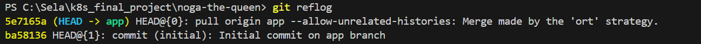
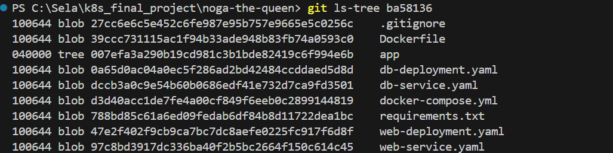
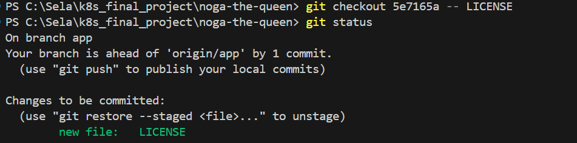

# Useful Tricks


## הוספת קבצים מקומיט קודם

אז קודם כל- למה שתצטרכו את זה?

    + אם יצרתם קבצים והעליתם בcommit קודם, החלטתם לשנות אותם, ועכשיו אתם רוצים לחזור לגרסא הקודמת
   
    + אם בטעות מחקתם קובץ אחרי שביצעתם לו commit ואתם לא מצליחים לשחזר (ואתם גם לא רוצים לטעון את כל הפרוייקט מהקומיט הקודם)
הנה דוגמא קטנה רק כדי להמחיש:

בר רפאלי- המתכנתת הכי טובה שלנו עשתה pull remote ואיבדה את קובץ הREADME שהיה לה בקומיט האחרון (באמת בר? פעם שלישית החודש)

 
כשיודעים שאיבדנו קובץ (ששוב, יכול לקרות בpull, בטעות, או בconflicts) יש דרך קלה לשחזר מקומיט קודם רק ב3 שורות פשוטות!  

( וללא cherry pick )

### קודם כל כדי לראות את הקומיטים הקודמים:
```bash
git reflog
```



 מצופה שנראה משהו כזה.


 כמו שניתן יכול לראות, יש את ה ```initial commit``` ואת ה ```pull merge commit``` שבעקבותו נמחק לבר קובץ הREADME


עכשיו אנחנו רואים את הSHA של הקומיטים.

כדי לבדוק אילו קבצים היו לנו בקומיט :
```bash
git ls-tree <commit-sha>
```

נשתמש בשם של הקומיט עם הקובץ אותו אנחנו רוצים לשחזר:



ונקבל את רשימת הקבצים שהעלינו.

#### או אם אנחנו יודעים את שם הקובץ
 (במקרה הזה- ```README```) ואנחנו רוצים לראות את התוכן שלו בקומיט הספציפי, נוכל לרשום
```bash
git show <commit-sha>:README*
```
ונראה את התוכן שלו מוצג על הטרמינל.


לאחר מכן- מה שנשאר הוא רק לבחור בקובץ דרך checkout- ממש כמו שעושים עם branches:

```bash
git checkout <commit-SHA> -- filename
```



וזהו! הוספנו את כל הקבצים שרצינו מהקומיטים הקודמים

אז לסיכום:
```bash
+ git reflog
```
```bash
+ git ls-tree <commit-SHA>
```
```bash
+ git checkout <commit-SHA> -- filename
```

## עכשיו אתם יכולים למחוק קבצים להנאתכם ולשחזר אותם🎉🎉🎉 (בבקשה אל)
